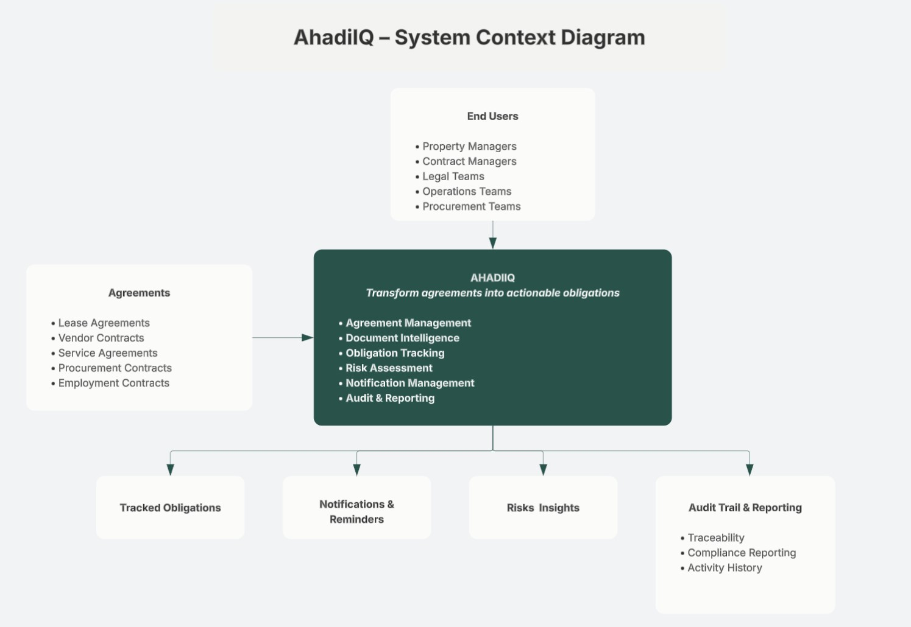
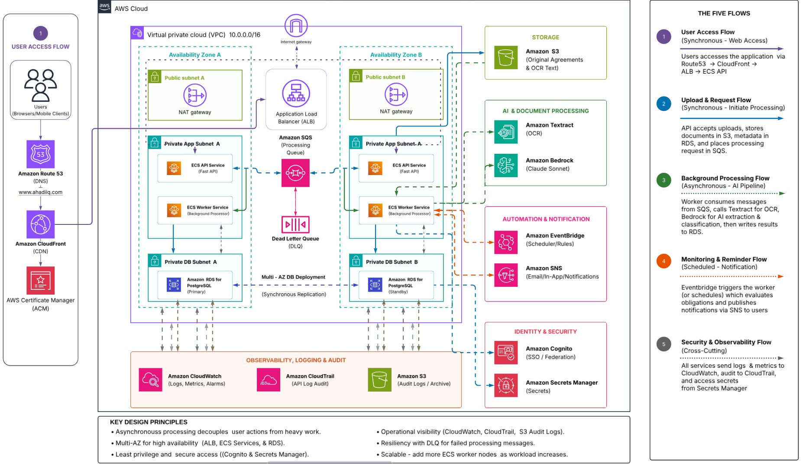

# AhadiIQ

> **Transform agreements into actionable obligations.**

AhadiIQ is a cloud-native Agreement Intelligence and Obligation Tracking Platform that transforms contracts, leases, procurement agreements, vendor agreements, employment contracts, and other legally binding documents into structured, actionable operational records.

Rather than functioning as a traditional Contract Lifecycle Management (CLM) platform, AhadiIQ focuses on a different problem:

> **Helping organizations identify, track, assign, monitor, and fulfill contractual obligations before critical deadlines are missed.**

---

## System Context



---

## AWS Architecture



---

# Why AhadiIQ?

Organizations generate hundreds or even thousands of agreements throughout their operations.

While these agreements are usually stored safely, the obligations hidden within them are often managed manually through:

- spreadsheets
- email reminders
- shared calendars
- sticky notes
- human memory

As agreement volumes grow, organizations face challenges such as:

- missed renewal deadlines
- unintended auto-renewals
- compliance failures
- financial penalties
- missed reporting obligations
- operational risk
- poor visibility into contractual commitments

AhadiIQ addresses this problem by transforming static agreements into structured business entities that can be monitored throughout their lifecycle.

---

# Solution Overview

Users upload agreements through a secure web application.

The platform automatically:

- stores the original agreement
- extracts document text using OCR
- classifies the agreement
- extracts contractual clauses
- validates extracted information
- generates obligations
- calculates explainable risk scores
- assigns ownership
- schedules reminders
- records an auditable history of every action

The result is an operational platform that helps organizations fulfill contractual commitments before deadlines are missed.

---

# Key Features

## Agreement Management

- Secure agreement upload
- Multi-tenant architecture
- Agreement repository
- Processing status tracking

---

## Document Intelligence

- OCR using Amazon Textract
- Agreement classification
- Clause extraction
- Structured metadata extraction
- Explainable AI processing

---

## Obligation Tracking

Automatically generates operational obligations including:

- Renewals
- Payments
- Compliance activities
- Reporting deadlines
- Maintenance activities
- Reviews
- Termination actions

---

## Explainable Risk Assessment

Unlike many AI-powered systems, AhadiIQ does not ask an LLM to determine risk.

Risk scores are calculated using deterministic business rules such as:

- Auto-renewal clauses
- Penalty clauses
- Notice periods
- Missing expiry dates
- Restrictive termination conditions
- Financial commitments

Every risk score is fully traceable to the originating contractual clauses.

---

## Human Validation

Lower-confidence extractions are routed through a human review workflow before obligations become active.

Validation includes:

- OCR confidence
- Schema validation
- Pattern matching
- Cross-field consistency
- Business rule validation

---

## Notifications

Scheduled reminders are delivered using:

- Amazon EventBridge
- Amazon SNS

Notification workflows support:

- upcoming obligations
- overdue obligations
- escalation reminders

---

## Audit & Traceability

Every significant event is recorded, including:

- Upload
- OCR completion
- AI extraction
- Human approval
- Obligation creation
- Risk assessment
- Notification delivery
- Status updates

---

# High-Level Workflow

```text
User
   │
Upload Agreement
   │
Amazon S3
   │
Amazon SQS
   │
Worker Service
   │
Amazon Textract
   │
Amazon Bedrock
   │
Validation
   │
Generate Clauses
   │
Generate Obligations
   │
Generate Risks
   │
Amazon RDS
   │
Dashboard
   │
Amazon EventBridge
   │
Amazon SNS
```

---

# AWS Architecture

## Compute

- Amazon ECS (AWS Fargate)
- FastAPI
- Background Worker

---

## Storage

- Amazon S3
- Amazon RDS for PostgreSQL

---

## AI Services

- Amazon Textract
- Amazon Bedrock (Claude Sonnet)

---

## Messaging

- Amazon SQS
- Dead Letter Queue (DLQ)

---

## Identity

- Amazon Cognito

---

## Scheduling

- Amazon EventBridge

---

## Notifications

- Amazon SNS

---

## Monitoring

- Amazon CloudWatch
- AWS CloudTrail

---

## Secrets

- AWS Secrets Manager

---

# Architecture Principles

The platform was designed around several cloud-native principles.

### Asynchronous Processing

Document processing is decoupled from user interactions using Amazon SQS.

Users can upload agreements without waiting for AI processing to complete.

---

### Explainability

AI extracts information.

Business rules make decisions.

The system intentionally separates AI-generated outputs from deterministic business logic.

---

### Scalability

Processing workers scale independently from API services.

Future deployments can increase worker capacity without affecting user-facing APIs.

---

### High Availability

The production architecture supports:

- Multi-AZ deployment
- Multiple ECS services
- Managed AWS services
- Fault isolation

The MVP intentionally deploys:

- One API task
- One Worker task
- One PostgreSQL instance

to minimize operational cost while preserving a migration path toward production.

---

# Repository Structure

```text
ahadiiq/

├── app/
│   ├── api/
│   ├── core/
│   ├── services/
│   ├── workers/
│   ├── models/
│   ├── repositories/
│   └── utils/
│
├── infrastructure/
│   ├── terraform/
│   ├── ecs/
│   ├── networking/
│   └── iam/
│
├── docs/
│   ├── aws-architecture.png
│   ├── system-context-diagram.png
│   ├── screenshots/
│   └── decisions/
│
├── tests/
│
├── docker/
│
├── scripts/
│
├── requirements.txt
│
└── README.md
```

---

# Technology Stack

| Category | Technology |
|-----------|------------|
| Backend | FastAPI |
| Containers | Docker |
| Orchestration | Amazon ECS (Fargate) |
| Database | PostgreSQL |
| Object Storage | Amazon S3 |
| Queue | Amazon SQS |
| OCR | Amazon Textract |
| AI | Amazon Bedrock (Claude Sonnet) |
| Authentication | Amazon Cognito |
| Scheduling | Amazon EventBridge |
| Notifications | Amazon SNS |
| Monitoring | Amazon CloudWatch |
| IaC | Terraform |

---

# Roadmap

## MVP

- Agreement upload
- OCR
- Clause extraction
- Obligation generation
- Risk assessment
- Notifications
- Dashboard

---

## Future Enhancements

- Multi-language agreements
- Clause comparison
- Advanced analytics
- Tenant administration
- Workflow customization
- Search optimization
- Fine-grained RBAC
- Auto Scaling
- Multi-AZ database deployment

---

# Project Status

🚧 Active Development

This project is currently being built as part of my Cloud Infrastructure Engineering portfolio with a strong focus on cloud-native architecture, infrastructure as code, distributed systems, and AI-powered document processing.

---

# Author

**Mohamud Rashid**

Cloud Infrastructure Engineer

Building production-ready cloud-native systems using AWS, Terraform, Python, Docker, Kubernetes, and AI services.

LinkedIn: https://www.linkedin.com/in/mohamud-rashid/

GitHub: https://github.com/moharashid

---

## License

MIT License